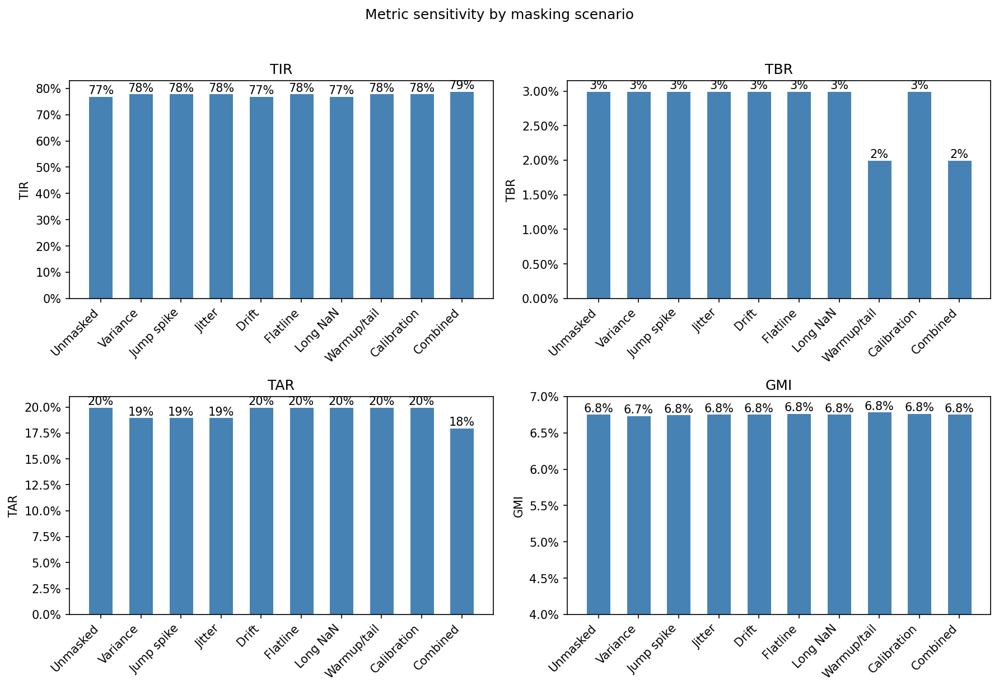
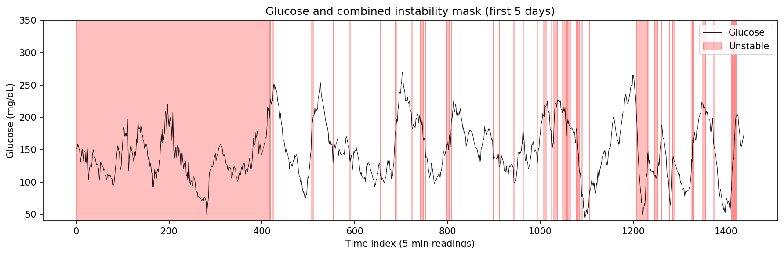

---
author:
    name: "Angelo Monroy"
date: today
title: "Personal CGM Data EDA"
format: html
---

# Intro

Performing EDA of personal CGM data for use in hidden-instability. Dexcom CGM G7 is an FDA-approved medical device that continuously monitors glucose via measuring of interstitial fluid. It lasts for 10 days + 12 hour grace period.

```{r}
#| label: libraries
#| message: false

library(readr)
library(dplyr)
library(tidyr)
library(lubridate)
library(ggplot2)

# interactive source
# source("R/helpers.R")
# render source
source("../R/helpers.R")
```

# Data

Data was sourced from Dexcom Clarity app January 23, 2026.

## R

```{r}
#| label: load-raw-local
#| message: false

# First CSV in data/raw (e.g. Clarity export); try project root or parent (when rendering from notebooks/)
raw_path <- list.files("data/raw", pattern = "\\.csv$", full.names = TRUE)
if (length(raw_path) == 0) raw_path <- list.files("../data/raw", pattern = "\\.csv$", full.names = TRUE)
if (length(raw_path) == 0) stop("No CSV found in data/raw or ../data/raw")
df <- read_csv(raw_path[1], show_col_types = FALSE)
problems(df)
```

CSV had 17 rows missing NA for last column. Manually fixed data and reread csv.

```{r}
#| label: reload-raw-local
#| message: false

df <- read_csv(raw_path[1], show_col_types = FALSE)
```

```{r}
#| label: tidy-dfs

meals <- df |>
    filter(`Event Type` == "Meal") |>
    drop_empty_columns()

cgm <- df |>
    filter(`Event Type` == "EGV") |>
    drop_empty_columns()

old_cgm_colnames <- colnames(cgm)
colnames(cgm) <- c("index", "ts", "type", "subtype", "device", "egv", "device_tick", "device_id")

calibrations <- df |>
    filter(`Event Type` == "Calibration") |>
    drop_empty_columns()
```

Tables and figures in this section and below come from `notebooks/tables/` and `notebooks/images/`. They can be generated by running from the project root (with venv activated):

```bash
python scripts/build_eda_data.py
```

# EDA

```{r}
#| label: basic-sum

data_completion <- (nrow(cgm)/1440*5) / as.numeric(max(cgm$ts) - min(cgm$ts))

```

## Summary

* Time Period: `{r} format(min(cgm$ts), "%B %d, %Y")` - `{r} format(max(cgm$ts), "%B %d, %Y")`
* Device: `{r} unique(cgm$device)`
* Data Availability: `{r} pct(data_completion, 1)`
* CGMs Used in Period: `{r} length(unique(cgm$device_id))`
* Manual BGM Calibrations: `{r} nrow(calibrations)`
* Meal Entries: `{r} nrow(meals)`

## Visualizations

```{r}
#| label: by-hour-viz

hourly_df <- read_csv("tables/hourly_metrics.csv", show_col_types = FALSE)
hourly_df$hour <- as.integer(hourly_df$hour)
hourly_df$hour_label <- format(
  as.POSIXct(sprintf("2000-01-01 %02d:00:00", hourly_df$hour),
             format = "%Y-%m-%d %H:%M:%S",
             tz = "America/Los_Angeles"),
  "%I:%M %p"
)

rects <- data.frame(
  ystart = c(40, 70, 180),
  yend   = c(70, 180, 300),
  Region    = c("Low", "In Range", "High")
)

ggplot(hourly_df, aes(x = factor(hour, labels = hour_label), y = mean)) +
  geom_rect(
    data = rects,
    aes(ymin = ystart, ymax = yend, xmin = -Inf, xmax = Inf, fill = Region),
    inherit.aes = FALSE,
    alpha = 0.4
  ) +
  geom_line(group = 1) +
  scale_y_continuous(
    limits = c(40, 300),
    breaks = c(40, 70, 100, 120, 150, 200, 250, 300)
  ) +
  labs(
    x = "Hour of Day",
    y = "Mean Blood Glucose mg/dL",
    title = "Mean Glucose by Hour"
  ) +
   theme(axis.text.x = element_text(angle = 45, hjust = 1, vjust = 1))
```


## Glycemic Analysis

```{r}
#| label: glyc-metrics

glycemic_metrics <- read_csv("tables/glycemic_metrics.csv", show_col_types = FALSE)
glycemic_metrics
```

# Masking Analysis

Excluding unstable segments (sensor noise, spikes, flatlines, dropouts) changes TIR, TBR, TAR, and GMI. Below we compare metrics with no masking, with each heuristic applied alone, and with the combined instability mask.

```{r}
#| label: masking-table

masking_summary_df <- read_csv("tables/masking_summary.csv", show_col_types = FALSE)
# Rename for display
masking_summary_df <- masking_summary_df |>
  rename("% flagged" = pct_flagged, "Mean (mg/dL)" = Mean_mg_dL)
masking_summary_df
```

```{r}
#| label: masking-bar-chart
#| fig-cap: "TIR, TBR, TAR, and GMI by masking scenario. Excluding unstable segments (per heuristic or combined) can shift metrics relative to unmasked analysis."


```

Excluding unstable segments changes reported TIR, TBR, and TAR because masked readings are dropped from both numerator and denominator. The combined mask typically has the largest effect; per-heuristic rows show which failure modes (variance, spikes, flatline, etc.) move the metrics most in this dataset.

```{r}
#| label: masking-time-series
#| fig-cap: "CGM glucose and combined instability mask over a 5-day window. Shaded regions indicate readings flagged as unstable and excluded from masked metrics."


```

# Conclusion

Clinical significance for time-in-range metrics is commonly placed at >= 5%. While changes in metrics did not reach clinical significance with unstable segments masked, there were minor improvements across metrics with instability masked. 

Adding more data sources, such as synthetic CGM data to include people of different health statuses, would strengthen the analysis, as my personal blood glucose was overall already well controlled. With wider fluctuations, instability may rise.

Further work could refine masks based on biological data such as glycemic patterns as well as CGM sensor specific deviations. 

# References

Cichosz SL, Xylander AAP. A Conditional Generative Adversarial Network for Synthesis of Continuous Glucose Monitoring Signals. J Diabetes Sci Technol. 2021 May 30:19322968211014255. doi: 10.1177/19322968211014255. Epub ahead of print. PMID: 34056935